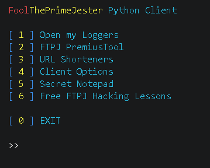
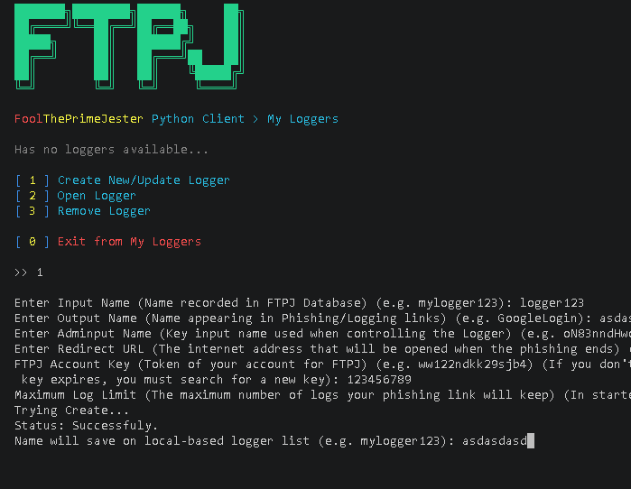
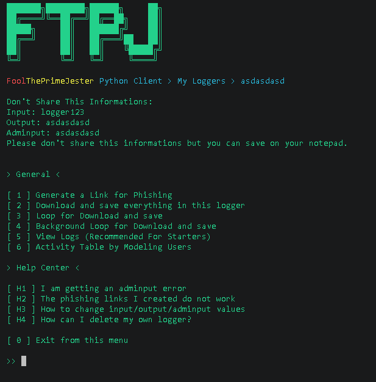
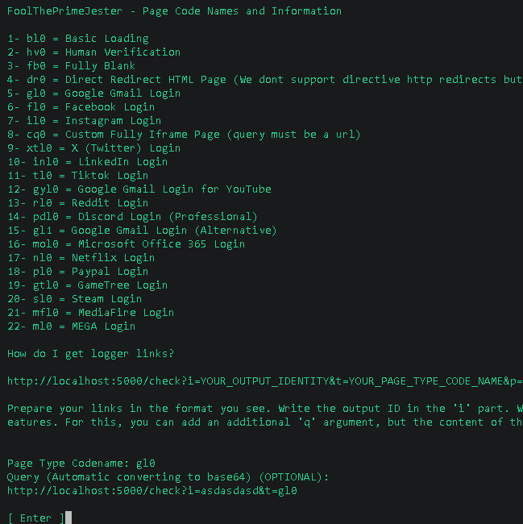
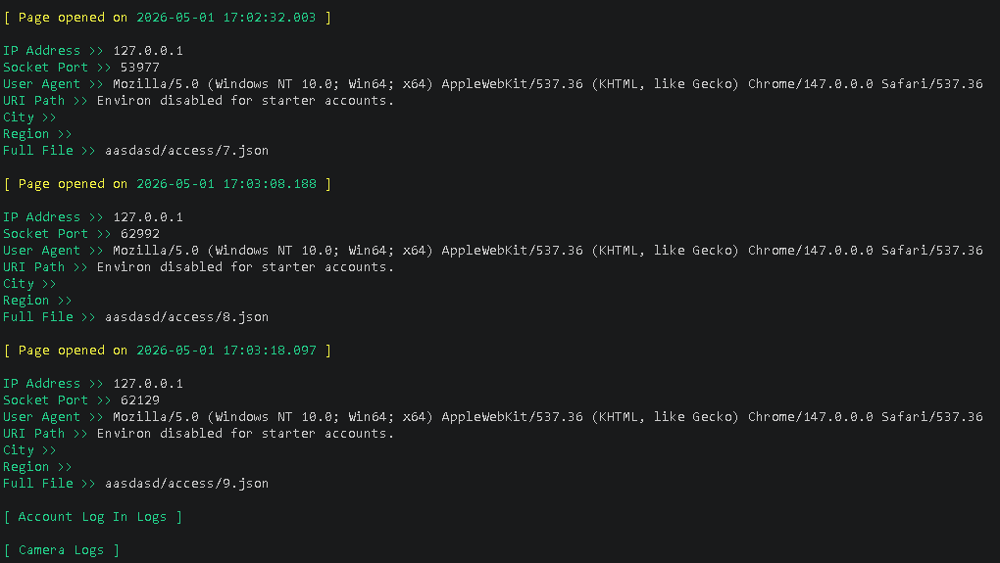
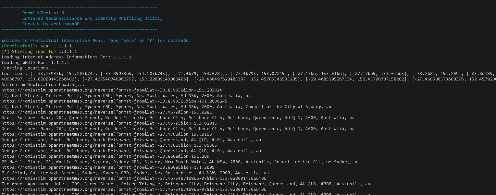
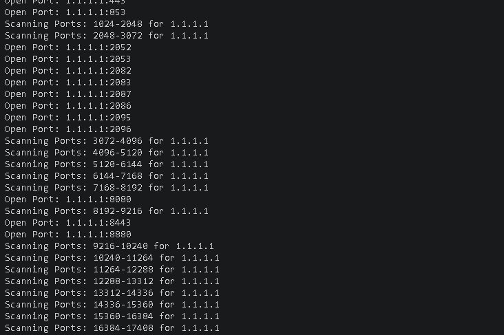
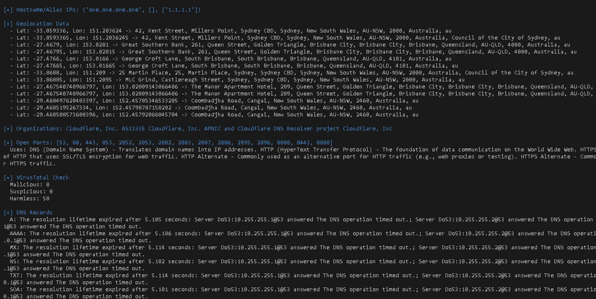

# FoolThePrimeJester (FTPJ)

**Advanced Social Engineering & Reconnaissance Framework**

---

### ⚠️ Important Legal & Ethical Warning

**FoolThePrimeJester** is a powerful social engineering and information gathering tool. It is intended **strictly for educational, security research, authorized penetration testing, and red teaming purposes**.

Any illegal use, unauthorized phishing, credential harvesting, or malicious activity is **strictly prohibited** and may result in legal consequences. 

Use this tool responsibly and ethically. The developers assume no liability for misuse.

---

### What is FoolThePrimeJester?

**FoolThePrimeJester** (FTPJ) is a Flask-based social engineering framework designed to create advanced logging links (IP loggers + phishing pages) and collect detailed information from targets through social engineering techniques.

The name "FoolThePrimeJester" roughly translates to **"Fool the Prime Jester"** — implying the goal of bypassing even security-conscious, high-awareness individuals ("Prime Jesters").

It is the successor/improved version of previous tools like **ClayFool**.

---

### Project Status

- **Stage**: Early / Incomplete Development
- Due to insufficient time, many planned premium features could not be fully implemented.
- **PremiusTool** has been integrated as a separate reconnaissance module.
- The project was initially planned as closed-source but was released as **open-source** for the community.

**We apologize** for not meeting the high expectations initially set for the tool.

---

### Repository Files

| File                        | Description |
|----------------------------|-----------|
| `FoolThePrimeJester.py`    | Main Flask server – handles logging, phishing pages, and admin functions |
| `FoolThePrimeJester_Client.py` | Client tool for generating logger links and managing campaigns |
| `PremiusTool.py`           | Advanced OSINT / Reconnaissance & Profiling utility |
| `ssp_keys.txt`             | ShieldSSP premium keys (unlimited features) |
| `starter_keys.txt`         | Limited free tier keys |

---

### FoolThePrimeJester – Main Features

#### Core Logging Capabilities
- Detailed IP logging + rich browser/device fingerprinting
- Collection of User-Agent, screen resolution, language, timezone, referrer, etc.
- VPN / Proxy / Tor / Datacenter / Hosting detection (keyword-based + IP reputation sources)

#### Phishing Templates (High-Quality Fake Login Pages)
- Google / Gmail
- Facebook
- Instagram
- X (Twitter)
- Netflix
- PayPal
- Steam
- Microsoft / Office 365
- MediaFire, MEGA, and others

Most templates include:
- Realistic design and styling
- Email + Password capture (`type: "account"`)
- Media processing in background (camera + microphone attempts)

#### Media Grabbing (Camera & Microphone)
- Attempts to request camera and microphone access using `getUserMedia()`
- Tries multiple camera devices
- Captures low-resolution photos (128x128) and short audio recordings
- Sends data back to the server as base64

> **Note**: Success rate is **low** on modern browsers (Chrome, Firefox, Edge) due to strict permission policies and HTTPS requirements.

#### Other Features
- Custom "Human Verification", "Loading...", and blank pages
- Direct redirect option
- Custom iframe page support
- Simple admin interface (`adminput` links) to view collected logs
- Two-tier key system: Starter (limited) vs SSP (premium/unlimited)

---

### PremiusTool – Advanced Reconnaissance Module

**PremiusTool** is a powerful standalone OSINT and scanning utility included in the repository.

#### Main Features of PremiusTool

- **Deep Host/Domain Lookup**
  - Multiple geolocation sources (ipapi.co, ipinfo.io, ip-api.com, ipwho.is, etc.)
  - Reverse geocoding via Nominatim
  - WHOIS information
  - DNS record enumeration (A, AAAA, MX, NS, TXT, SOA, CNAME, etc.)

- **Port Scanning**
  - Full TCP port scanning (or range-based)
  - Service usage descriptions for well-known ports

- **Security & Threat Intelligence**
  - VirusTotal IP address check
  - SSL/TLS certificate extraction and analysis

- **Web & HTTP Analysis**
  - HTTP method scanning (GET, POST, PUT, OPTIONS, TRACE, etc.)
  - Custom header spoofing (X-Forwarded-For, X-Real-IP, etc.)

- **Additional Tools**
  - DNSDumpster integration
  - DuckDuckGo search integration
  - Interactive CLI with `cmd` module

Note: It can find 200 KB data from a single ip address.

#### PremiusTool CLI Features
- `scan <target>` → Full reconnaissance on domain or IP
- `search <query>` → DuckDuckGo search
- Profile system (`create_profile`, `load_profile`, `set_profile`, `add_entity`, `expand_data`, `find_identity`)
- Save all results as timestamped JSON files
- Colored output with `colorama`

---

### Deployment Recommendation

- **Server (`FoolThePrimeJester.py`)**: Best deployed on **PythonAnywhere** (free tier works for testing).
- Local testing is also possible (`python FoolThePrimeJester.py`).

---

### Limitations (Honest Assessment)

- Camera & microphone grabbing works inconsistently due to browser security.
- VPN/Proxy detection is basic (keyword-based).
- Information Lookup Service (planned advanced enrichment) was **not implemented**.
- Database is simple JSON file (not production-grade).
- Code quality and structure still need improvement.
- PremiusTool is powerful but can be slow during full port scans.

---

### Ethical Use Guidelines

You may use this tool for:
- Personal learning and skill development
- Authorized security assessments
- Red team exercises (with permission)
- Security awareness training

You must **not** use it for:
- Phishing unsuspecting individuals
- Stealing credentials
- Any form of cybercrime or harassment

---

### Future Roadmap

- Stabilize core server and fix bugs
- Implement Information Lookup Service (separate module)
- Improve documentation and add Wiki
- Better database backend (SQLite / PostgreSQL)
- Enhanced client interface
- Code refactoring and optimization

---

### License

MIT License

---

### Final Note from the Developer

> FoolThePrimeJester and PremiusTool are **learning instruments**, not weapons.  
> Social engineering is an extremely powerful technique. With great power comes great responsibility.
We will continue developing and improving the project when time permits. Contributions, suggestions, and constructive feedback are welcome.
